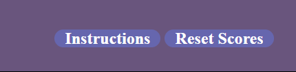

# Table of Contents

- [Table of Contents](#table-of-contents)
- [Paper Rock Scissors Game](#paper-rock-scissors-game)
- [1. Project Overview](#1-project-overview)
  - [1.1 Project Objective](#11-project-objective)
  - [1.2 User Stories](#12-user-stories)
    - [First time users](#first-time-users)
    - [Returning users](#returning-users)
    - [Site Owner](#site-owner)
  - [1.3 Design](#13-design)
- [2. Features](#2-features)
  - [2.1 Logo Header Area](#21-header-area)
  - [2.2 Game Buttons and Result Area](#22-game-choices-area)
  - [2.3 Score Count \& Images Area](#23-score-count--images-area)
  - [Footer Section](#footer-section)
  - [2.4 Features to Implement](#24-features-to-implement)
- [3. Testing](#3-testing)
  - [3.1 HTML Validation](#31-html-validation)
    - [Home Page](#home-page)
  - [3.2 CSS Validation](#32-css-validation)
  - [Acessibility Validation Service](#acessibility-validation-service)
  - [3.3 Lighthouse](#33-lighthouse)
  - [3.4 Manual Testing User Stories](#34-manual-testing-user-stories)
  - [3.5 Bugs and Fixes](#35-bugs-and-fixes)
- [4. Deployment](#4-deployment)
- [5. Credits](#5-credits)
  - [5.1 Images Used](#51-images-used)
  - [5.2 Code](#52-code)

# Paper Rock Scissors Game

Live link:- https://sammy92dec.github.io/rspgame/

# 1. Project Overview

Paper, Rock, and Scissor is an interactive web app centered on allowing the user to pass the time playing a fun game. The look, feel, and functionality will be explained in the following sections:

## 1.1 Project Objective

The project objective was to create an interactive and visually appealing web app, catering to those who enjoy video games, as well as games of chance.

## 1.2 User Stories

### First time users

- As a first time user I want an excellent visual experience.
- As a first time user I want to easily interact with website content.
- As a first time user I want to be able to ask for instructions of how te game is played.
- As a first time user I want to easily distingish this site as a trusted site which is safe to use.

### Returning users

- As a returning user I would like to see regular game updates.
- As a returning user I would like to have a history of my gaming score.

### Site Owner

- As a site owner I want to provide a fun and interactive gaming experience.
- As a site owner I want to have my site visually stand out.

## 1.3 Design

To serve as a gaming website, a simplistic but functional design was needed. This combination served two primary purposes. The first purpose, simplicity, was used to maintaine a pleasant look and asthetic to cater and appeal to users of varying age groups.

For the color scheme those are the colors that stand out.I used "http://colormind.io/image/" for my color palette.

# 2. Features

The website is a two pages which you can play in one page and read instructions if you press te instruction button it will take you to oter page.This gives the user the ability to play the well-known Paper, Rock, and Scissors game if tey are famliar with it.

## 2.1 Logo and Header Area

The website was organized into six main sections, those being the logo, header, score area, result area, control area and the footer.

The logo just on the top to make the page look nicer.

The header has instrutions and a button to reset the game and scores.

## 2.2 Game Buttons and Result Area

The 

The game choices area gives the user the opportunity to choose between rock, paper, scissors.

## 2.3 Score Count & Images Area

The game score section has the following functionalies: 

  1. Upon the user making a choice, the image and background color changes to reflect this choice.
  2. The game winer score count tally is incremented by 1 for every successful game won. A draw will result in no incrementation of user or computer score.

## Footer Section

The footer section contains only a copy right text.

## 2.4 Features to Implement

When there is time, I would like to add a player high score area, so that returning users are able to see their placement within all users who may have played the game on this website.

<!--
# 3. Testing

## 3.1 HTML Validation

All documents were validated using the free W3C Markup validation service. A majority of initial errors received pertained to the H2 statements having missing closing statements due to re-editing certain lines of code.

Chrome development tools, as well as Firefox development tools where used to view the site behavior for functionality.

### Home Page

## 3.2 CSS Validation

<!--To validate the site CSS, the site CSS file was uploaded to the W3C Jigsaw validation service. The first attempt indicated a CSS rule regarding max-width that had to be altered to return back an error free test result. 

## Acessibility Validation Service

The Wave web accessibility evaluation tool was used to ensure that the site passed the industry-standard accessibility criteria. The results indicated no errors and good site structure.

## 3.3 Lighthouse

The Lighthouse performance app was used to test the website performance.

JsHint version 2.13.6 was used to test the javascript for the site and did not return any major issues that needed to be addressed within this iteration of the game. 

-->

# 4. Deployment
<!--
This website was developed using Gitpod, via the gitpod/github applications and repositories. The following steps were taken:

    1. Navigate to the Benjamin Banneker githup repository
    2. Select the settings tab
    3. Select Pages within the left navigation payne
    4. Select the deploy from branch (main branch) under source
    5. Upon succesful completion of the app and refresh of page the link is displayed

   You may view the Github repository by clicking <a href="https://github.com/ericjonesdev/rock-paper-scissors">here</a>.

# 5. Credits

## 5.1 Images Used

   The following URLs are the sources of images:

https://unsplash.com/@imanitor?utm_source=unsplash&utm_medium=referral&utm_content=creditCopyText

three friends by cottonbro studio: https://www.pexels.com/photo/friends-playing-together-10506091/

https://www.freeimages.com/download/rock-paper-scissors-1238146

## 5.2 Code

The following github respository was used as a template upon which this website was built:
https://github.com/kubowania/rock-paper-scissors-x3/blob/main/rock-paper-scissors-examples/rock-paper-scissors-example-1/app.js
-->