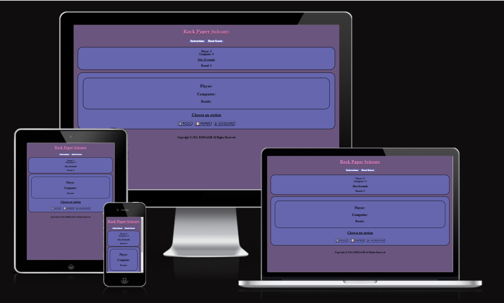
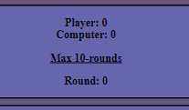
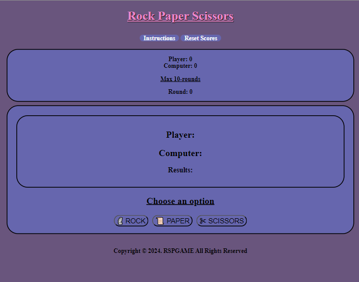

# Table of Contents

- [Table of Contents](#table-of-contents)
- [Paper Rock Scissors Game](#paper-rock-scissors-game)
- [1. Project Overview](#1-project-overview)
  - [1.1 Project Objective](#11-project-objective)
  - [1.2 User Stories](#12-user-stories)
    - [First time users](#first-time-users)
    - [Returning users](#returning-users)
    - [Site Owner](#site-owner)
  - [1.3 Design](#13-design)
- [2. Features](#2-features)
  - [2.1 Header Area](#21-logo-and-header-area)
  - [2.2 Result Area and Control Area](#22-result-area-and-control-area)
  - [2.3 Score Area](#23-score-area)
  - [Footer Section](#footer-section)
  - [2.4 Instructions](#24-instructions)
  - [2.5 Features to Implement](#24-features-to-implement)
- [3. Testing](#3-testing)
  - [3.1 HTML Validation](#31-html-validation)
    - [Home Page](#home-page)
  - [3.2 CSS Validation](#32-css-validation)
  - [3.2 JS Validation](#33-JS-validation)
  - [Acessibility Validation Service](#acessibility-validation-service)
  - [3.4 Lighthouse](#34-lighthouse)
  - [3.5 Bugs and Fixes](#35-bugs-and-fixes)
- [4. Deployment](#4-deployment)
- [5. Credits](#5-credits)
  - [5.1 Images Used](#51-images-used)
  - [5.2 Code](#52-code)

# Paper Rock Scissors Game

Live link:- https://sammy92dec.github.io/rspgame/

# 1. Project Overview

Paper, Rock, and Scissor is an interactive web app centered on allowing the user to pass the time by playing a fun game. The look, feel, and functionality will be explained in the following sections:

## 1.1 Project Objective

The project objective was to create an interactive and visually appealing web app, catering to those who enjoy video games, as well as games of chance.

## 1.2 User Stories

### First time users

- As a first time user I want an excellent visual experience.
- As a first time user I want to easily interact with website content.
- As a first time user I want to be able to ask for instructions of how te game is played.
- As a first time user I want to easily distinguish this site as a trusted site which is safe to use.

### Returning users

- As a returning user I would like to see regular game updates.
- As a returning user I would like to have a history of my gaming score.

### Site Owner

- As a site owner I want to provide a fun and interactive gaming experience.
- As a site owner I want to have my site visually stand out.

## 1.3 Design

To serve as a gaming website, a simplistic but functional design was needed. This combination served two primary purposes. The first purpose, simplicity, was used to maintain a pleasant look and aesthetic to cater to and appeal to users of varying age groups.

For the color scheme, those are the colors that stand out. I used "http://colormind.io/image/" for my color palette.

# 2. Features

The website is  two pages you can play on one page and read instructions if you press the instruction button it will take you to other page. This gives the user the ability to play the well-known Paper, Rock, and Scissors game if they are familiar with it.

## 2.1 Logo and Header Area

The website was organized into five main sections, those being the logo, header, score area, result and control area and footer.

The logo is just on the top to make the page look nicer.

The header has instrutions and a button to reset the game and scores.

## 2.2 Result Area and Control Area

The result area is the choices displayed, by the player and computer. I chose texts and emojis to make the game simple.

The control area gives the user the opportunity to choose between rock, paper and scissors.

## 2.3 Score Area

This area includes the players, computers score and the number of rounds.

The game score section has the following functionalities: 
 
  - The game winner score count tally is incremented by 1 for every successful game won. A draw will result in no incrementation in user or computer score.

  - The rounds show how many games are played. Its only 10 rounds.

## Footer Section

The footer section contains only a copyright text.

## 2.4 Instructions

This is an HTML page where it explains to the user how to play and how many rounds.

## 2.5 Features to Implement

When there is time, I would like to add a player high score area, so that returning users are able to see their placement within all users who may have played the game on this website.

# 3. Testing

## 3.1 HTML Validation

All documents were validated using W3C Jigsaw HTML validation service.No error was found.

Chrome development tools, as well as Firefox development tools were used to view the site's behavior for functionality.

### Home Page

Live link:- https://sammy92dec.github.io/rspgame/

## 3.2 CSS Validation

To validate the site CSS, the site CSS file was uploaded to the W3C Jigsaw validation service. The first attempt indicated that there was an error in a class "text" that I wasn't even using. The way I fixed it is remove it.

## 3.3 Js Validation

JsHint version 2.13.6 was used to test the javascript for the site and did not return any major issues that needed to be addressed within this iteration of the game. 

### Accessibility Validation Service

## 3.4 Lighthouse

The Lighthouse performance app was used to test the website's performance.

## 3.5 Bugs and Fixes

Some bugs that were discovered and corrected throughout the development:
 | Bug                                                                                                                  | Fix                                                                                                |
 | ------------------------------------------------------------------------------------------------------------------------- | -------------------------------------------------------------------------------------------------------- |
 | Not being able to see if it's a win or lose. | It the emojis in front of the text.First I tried to use computerCamparison function but ad to fix the player botton as well. so the way it was fixed was by adding emojis in front the choices/buttons |
 | The scores where not adding up | After fixing the result the scores came along too  |                           

# 4. Deployment

Github Pages was used to deploy the live website. The instructions to achieve this are below:

- Log in (or sign up) to Github.
- Find the repository for this project, rock-paper-scissors.
- Click on the Settings link.
- Click on the Pages link in the left hand side navigation bar.
- In the Source section, choose main from the drop down select branch menu. Select Root from the drop down select folder menu.
- Click Save. Your live Github Pages site is now deployed at the URL shown.

   You may view the Github repository by clicking <a href="https://github.com/Sammy92dec/rspgame">Here</a>

# 5. Credits

- Eric Jones for sharing README text ideas. github :- https://github.com/ericjonesdev
- Ania Kubow for having alot of ideas to view. github :- https://github.com/kubowania/rock-paper-scissors-x3
- https://codebeautify.org/htmlviewer that helped me make my html organized.
- https://www.w3schools.com/ to check how and what choices to use most in my css.

## 5.1 Images Used

Not alot of images were used with this games.I went with emojis to make it simple and quick to code.
The images uploaded are screenshots from the actual game  for the README texts.It was taken by me.
No logo for the game.

## 5.2 Code

Code was recreated from my old project and added new features that would make it more self-made project.
github :- https://github.com/Sammy92dec/rspgame